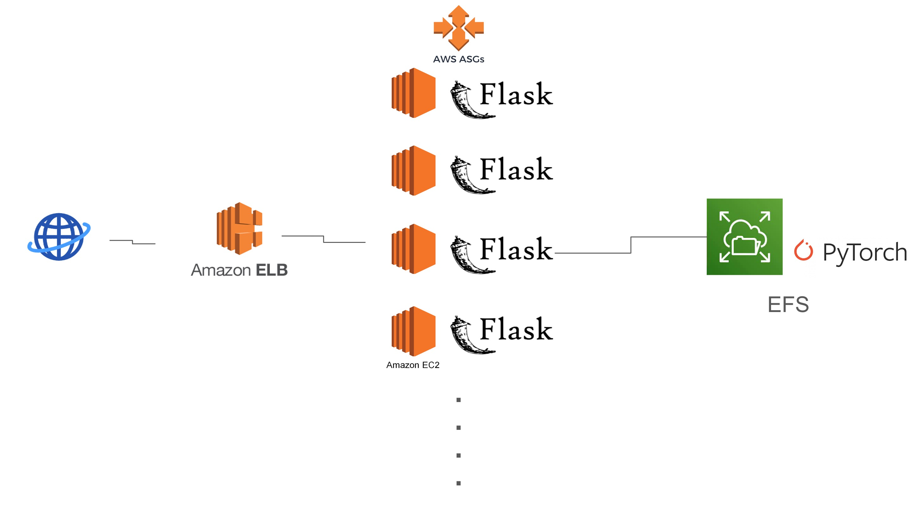

### Overview

'BlackRubberShoes' is an image generation application for the animation *Black Rubber Shoes*.

After building both a Lambda API and an auto-scaling instance server, I compared the availability and costs of the two servers.

- Documentation: [](BRS.pdf)
- Code: [](https://github.com/rkdbq/BRS_server) 
- Technologies Used:  |  |  |  | locust
- Dev. Environment:  |  | 
- Dev. Period: Sep. 2023 - Dec. 2023

### <u>My Contributions</u>

#### Generative model
1. Model Selection
- Selected the generative model (U-GAT-IT).
2. Training Dataset Construction

- Utilized the YOLO model to perform face detection to collect detected areas for constructing the dataset required for the generation model training.
3. Model Training

- Trained the model based on the constructed dataset and adjusted hyperparameters.
- Referenced the model's implementation details for appropriate hyperparameter selection.

#### Instance Server
4. Implementation

- Built the instance server using AWS Elastic Load Balancing, AWS Auto Scaling, and AWS Elastic File System.
- Mounted EFS to read the generated model code and execute it upon user requests.
- To prevent EFS mounting from the public VPC, each instance is routed to an IG, and inbound rules were adjusted to allow EFS to handle mounting requests only from the internal network.

#### Server Performance Evaluation
5. Load Testing

- Used locust to measure and compare the request processing time, number of requests handled, and success rates between the instance server and Lambda API.

### Limitations
1. Cost Reduction Issues
- I intended to archive input and output images in S3 instead of EFS for cost reduction, but due to issues with issuing IAM keys for student accounts, EFS was used instead.
