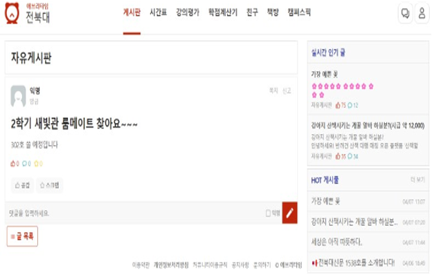
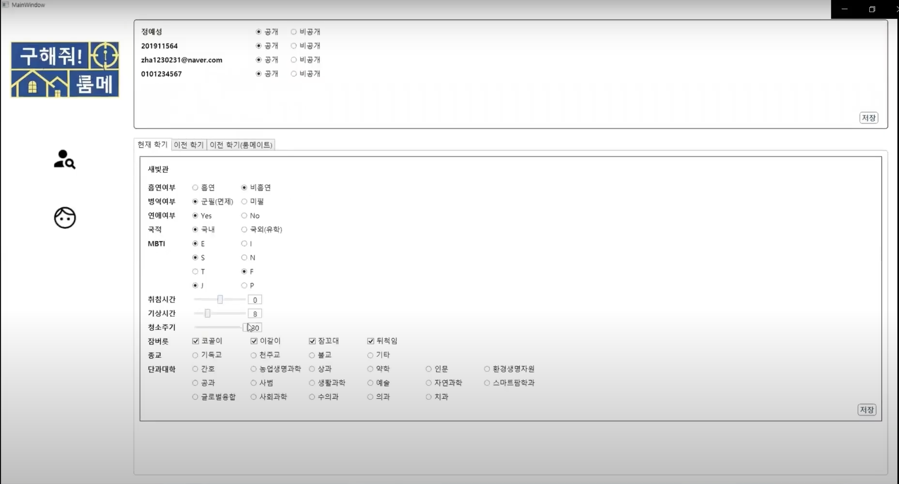

### Overview

'FindRoommate'is a Windows-based roommate matching platform.

Refactored by applying the MVVM design pattern.

- Documentation: [](구해줘!룸메.pdf)
- Code: [](https://github.com/rkdbq/FindRoommate) 
- Technologies Used: | WPF | 
- Dev. Environment: 
- Dev. Period: Mar. 2022 - Jun. 2022



<!-- ### 개발 동기

기존 시스템은 다음과 같은 문제를 지니고 있었습니다.

1. 흡연 유무, 수면 패턴 등 매우 제한적인 정보만으로 룸메이트를 정해야 했습니다.
2. 룸메이트를 찾기 위한 적절한 커뮤니티가 활성화되어 있지 않았습니다.
    
    - 에브리타임은 학교생활 커뮤니티의 역할만 할 뿐, 룸메이트를 구하기 위한 특별한 기능을 제공하지 않았습니다. 쪽지 기능을 통해 소통할 수 있으나, 이는 게시글을 작성해야만 사용할 수 있었습니다.
    
    - 하우스메이트라는 서비스는 기숙사 룸메이트 매칭을 위한 서비스가 아닌 자취를 위한 서비스만 존재했고, 상대 성향을 파악할 수 있는 기능이 매우 제한적이었습니다.

우리 팀은 위 문제를 해결하고자 구체적이고 능동적인 룸메이트 배정 방식을 도입한 프로그램을 만들고자 했습니다. -->

### <u>My Contributions</u>

1. Applied MVVM Design Pattern
    - Managed database data changes and design elements separately by separating UI and user input through Data Binding.
2. Feature Implementation
    
    - Email Verification: Ensured that users were university students by verifying the randomly generated and sent code with the user input during registration.
    
    - Profile: Parsed database information into a temporary object, allowing users to update the database information when they modified values.
    
    - Search: Displayed data retrieved from the database based on user input in a ListView.
    
    - Chat: Updated the chat message ListView when the send button was clicked or a message was received from the server.

### Limitations

1. Lack of Asynchronous Communication
    - It is regrettable that only socket-based real-time chat was implemented.
2. UI
    - Did not provide a user-friendly interface.