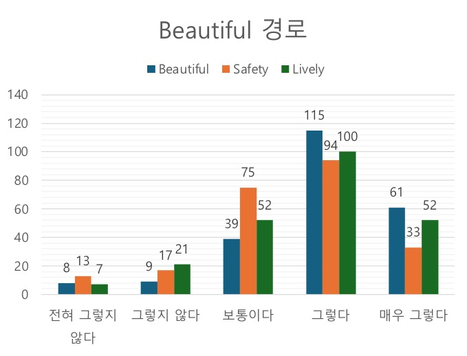

### Overview

'GaroBonneung'is a deep learning-based emotional routing application.

An emotional route is a path that considers the vibrancy, beauty, and stability of the street landscape, rather than just the shortest distance.

Collaborated with LX Corporation.

- Documentation: [](가로본능.pdf)
- Technologies Used:  |  |  | 
- Dev. Environment:  | 
- Dev. Period: Mar. 2024 - Jun. 2024

### <u>My Contributions</u>

1. Model Selection
- Selected a model trained with Tencent Map street landscape images, considering the license.
2. Score Prediction Pipeline
- Predicted scores of the street landscape images in all directions from a given location on the map.
- Normalized the predicted scores and tagged each node on the map.
3. Integrating Scores into the Routing Algorithm

- Incorporated the tagged scores into the routing algorithm.
4. Measuring Reliability through Surveys

- Conducted user satisfaction surveys to measure whether the routing results met the intended purpose.

### Limitations

1. Unable to Select a Model Trained with Place-Pulse Dataset
- The Place-Pulse dataset, which uses GSV evaluated through crowdsourcing from various cities, could be more advantageous for predicting domestic street landscapes.
- Although we intended to select a model based on the Place-Pulse dataset, we adopted a model trained with Tencent Map street landscape images due to licensing issues.