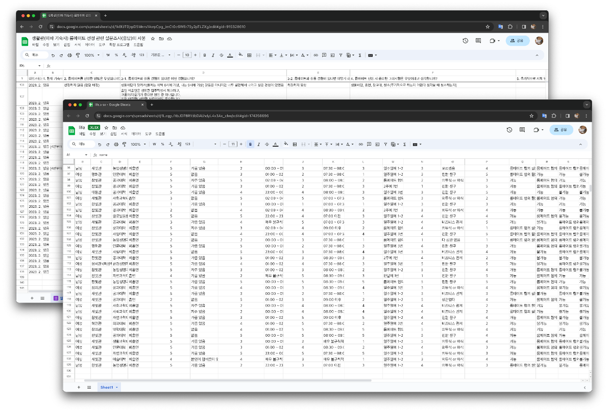
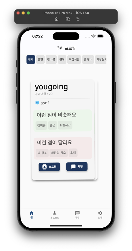
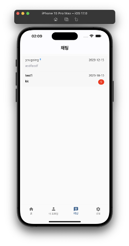

### Overview

'Roomie' is a mobile-based roommate matching platform.

Rebuilt and **deployed** the existing '[FindRoommate](../findRoommate)' project from scratch to fit the mobile environment.

- Deployment: [One Store](https://m.onestore.co.kr/mobilepoc/apps/appsDetail.omp?prodId=0000774374) | [App Store](https://apps.apple.com/us/app/roomie/id6477328689)
- Documentation: [](Roomie.pdf)
- Code: [](https://github.com/rkdbq/Roomie-v2) 
- Technologies Used:  |  | 
- Dev. Environment:  | 
- Dev. Period: Jan. 2023 - Feb. 2024

### <u>My Contributions</u>

1. Requirements Analysis
    
    - Conducted two surveys to quantitatively confirm user requirements.
    - Collected 138 responses in the first survey in Jan. 2023.
    - Collected 129 responses in the second survey in Jul. 2023.
2. Improved Recommendation System
    
    - Enhanced user convenience by switching from manual filter adjustments to Content-based Filtering.
    - Adopted Content-based Filtering as it does not require data from other users, making it suitable for the initial service launch.
    - Adjusted the weights of each item based on user feedback to recommend better profiles.
3. Chat
    
    - Transitioned from the existing socket communication method to an asynchronous method using Flutter's Stream, enabling asynchronous communication.

### Limitations

1. Lack of Maintenance
    - Failed to secure a sufficient user base due to the overhaul of the existing dormitory system.
2. Additional Features
    - Need to add detailed features such as multi-language support.