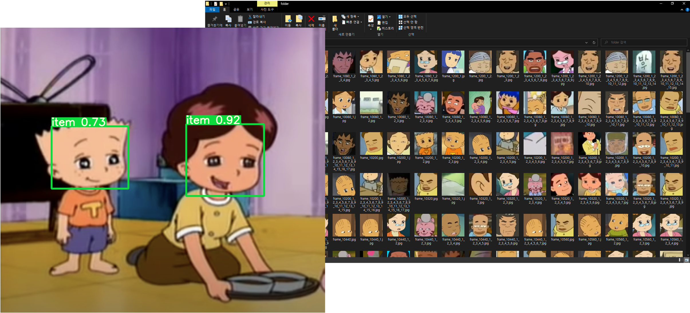
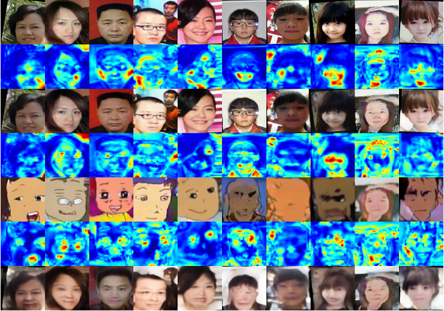
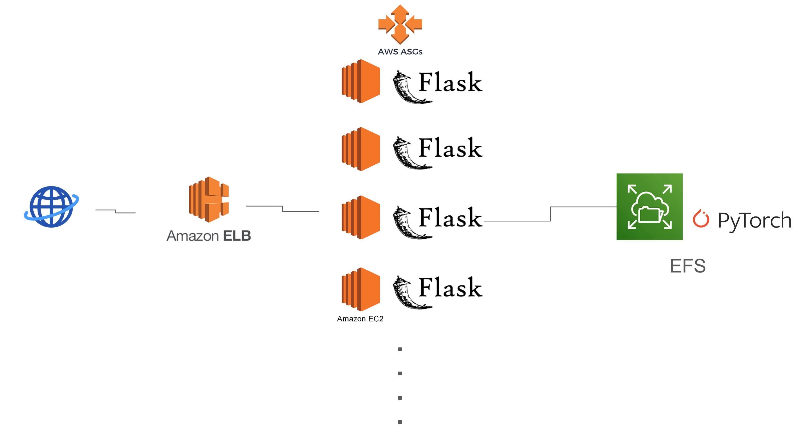
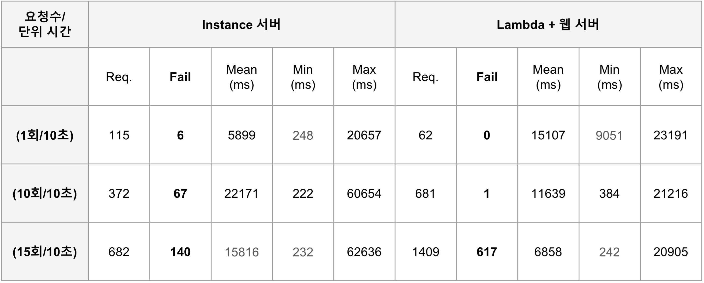
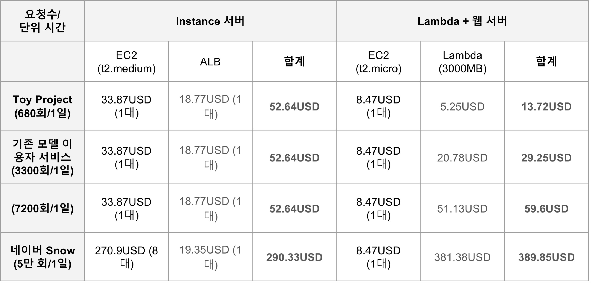

### 개요

'BlackRubberShoes'는 검정고무신 이미지 생성 애플리케이션입니다.

Lambda API와 오토 스케일링되는 인스턴스 서버를 각각 구축한 후, 두 서버의 가용성 및 비용을 비교했습니다.

- 문서: [](BRS.pdf)
- 코드: [](https://github.com/rkdbq/BRS_server) 
- 사용 기술:  |  |  |  | locust
- 개발 환경:  |  | 
- 개발 기간: 2023년 9월 - 2023년 12월

### <u>내가 기여한 점</u>

#### 생성 모델
1. 모델 선정
- 생성 모델을 선정했습니다. (U-GAT-IT)
2. 학습 데이터셋 구축

- 생성 모델 학습에 필요한 검정고무신 데이터셋 구축을 위해 YOLO 모델을 활용해 Face Detection을 수행한 후, 검출된 영역을 수집했습니다.
3. 모델 학습

- 구축한 데이터셋을 바탕으로 모델을 학습하며 하이퍼파라미터를 조정했습니다.
- 적절한 하이퍼파라미터 선정을 위해 모델의 Implementation detail을 참고했습니다.

#### 인스턴스 서버
4. 인스턴스 서버 구현 

- AWS Elastic Load Balancing과 AWS Auto Scaling
, AWS Elastic File System를 활용해 인스턴스 서버를 구축했습니다.
- EFS를 마운트해 적재된 생성 모델 코드를 읽어 유저 요청 시 실행하도록 했습니다.
- VPC 외부망에서의 EFS 마운트를 방지하기 위해 각 인스턴스들은 IG에 라우팅되고, EFS는 내부망에서의 마운트 요청만 처리할 수 있도록 인바운드 규칙을 조정했습니다.

#### 서버 성능 평가
5. 부하 테스트

- locust를 활용해 인스턴스 서버와 Lambda API의 요청 처리 시간과 요청 처리 건수, 성공률 등을 측정 및 비교했습니다.

### 한계
1. 비용 절감 문제
- 비용 절감을 위해 입출력 이미지의 아카이빙을 EFS 대신 S3에 수행하려 했으나, 학생 계정의 IAM 키 발급 문제로 인해 EFS를 사용했습니다.
