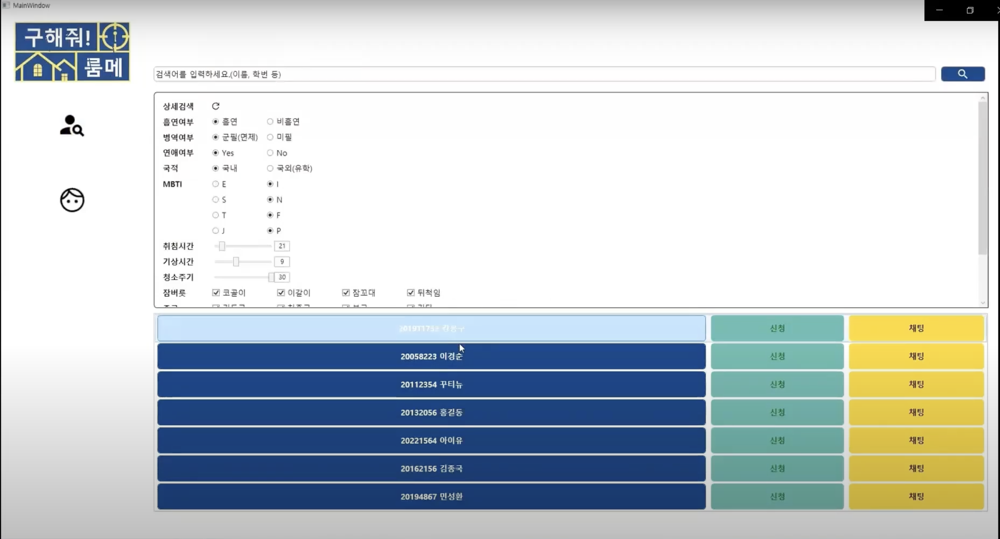

### 개요

'구해줘! 룸메'는 Windows 기반 룸메이트 매칭 플랫폼입니다.

MVVM 디자인 패턴을 적용하여 리팩토링했습니다.

- 문서: [](구해줘!룸메.pdf)
- 코드: [](https://github.com/rkdbq/FindRoommate) 
- 사용 기술: | WPF | 
- 개발 환경: 
- 개발 기간: 2022년 3월 - 2022년 6월



<!-- ### 개발 동기

기존 시스템은 다음과 같은 문제를 지니고 있었습니다.

1. 흡연 유무, 수면 패턴 등 매우 제한적인 정보만으로 룸메이트를 정해야 했습니다.
2. 룸메이트를 찾기 위한 적절한 커뮤니티가 활성화되어 있지 않았습니다.
    
    - 에브리타임은 학교생활 커뮤니티의 역할만 할 뿐, 룸메이트를 구하기 위한 특별한 기능을 제공하지 않았습니다. 쪽지 기능을 통해 소통할 수 있으나, 이는 게시글을 작성해야만 사용할 수 있었습니다.
    
    - 하우스메이트라는 서비스는 기숙사 룸메이트 매칭을 위한 서비스가 아닌 자취를 위한 서비스만 존재했고, 상대 성향을 파악할 수 있는 기능이 매우 제한적이었습니다.

우리 팀은 위 문제를 해결하고자 구체적이고 능동적인 룸메이트 배정 방식을 도입한 프로그램을 만들고자 했습니다. -->

### <u>내가 기여한 점</u>

1. MVVM 디자인 패턴 적용
    - Data Binding을 통해 UI와 사용자 입력을 분리함으로써 DB 데이터 변경과 디자인 요소를 각각 관리하도록 했습니다.
2. 기능 구현
    
    - 이메일 인증: 랜덤 생성해 발송한 코드와 사용자 입력이 일치하는지 확인함으로써 회원가입 시 교내 학생임을 보장했습니다.
    
    - 프로필: 임시 객체에 DB 정보를 파싱한 후, 사용자가 값을 수정했을 때 DB 정보를 갱신하도록 했습니다.
    
    - 검색: 사용자 입력으로 DB에서 탐색한 데이터를 ListView로 표시하도록 했습니다.
    
    - 채팅: 전송 버튼을 클릭했거나 서버에서 상대가 전송한 메시지를 확인했을 때 채팅 메시지 ListView를 갱신하도록 했습니다.

### 한계

1. 비동기 통신의 부재
    - 소켓 기반의 실시간 채팅만 구현했다는 점이 아쉬움으로 남습니다.
2. UI
    - 사용자 친화적인 인터페이스를 제공하지 못했습니다.