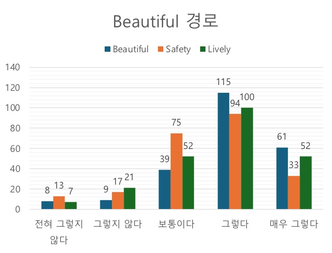

### 개요

'가로본능'은 딥러닝 기반 감성 경로 라우팅 애플리케이션입니다.

감성 경로란 가로경관의 활기와 아름다움, 안정감 등을 고려하여 라우팅한 최단 경로가 아닌 경로를 말합니다.

LX 한국국토공사와 산학 협력했습니다.

- 문서: [](가로본능.pdf)
- 사용 기술:  |  |  | 
- 개발 환경:  | 
- 개발 기간: 2024년 3월 - 2024년 6월

### <u>내가 기여한 점</u>

1. 모델 선정
- 라이센스를 고려해 Tencent Map 가로경관 이미지로 학습한 모델을 선정했습니다.
2. 점수 예측 파이프라인 작성
- 지도의 한 위치에서 사방의 가로경관 이미지의 점수를 예측했습니다.
- 예측 점수를 정규화해 지도의 각 노드에 태깅했습니다.
3. 라우팅 알고리즘에 점수 반영

- 라우팅 알고리즘에 태깅한 점수를 반영했습니다.
4. 설문을 통한 신뢰도 측정

- 사용자 만족도를 조사해 라우팅 결과가 목적에 부합하는지 측정했습니다.

### 한계

1. Place-Pulse 데이터셋을 통해 학습한 모델 선정 불가
- Place-Pulse 데이터셋은 다양한 도시로부터 크라우드 소싱으로 평가한 GSV를 이용해 구축한 데이터셋이기 때문에 국내 가로경관 예측에 더 유리할 수 있습니다.
- Place-Pulse 데이터셋을 기반으로 하는 모델 중 선정하려 했으나, 라이센스 문제로 인해 Tencent Map 가로경관 이미지로 학습한 모델을 채택했습니다.