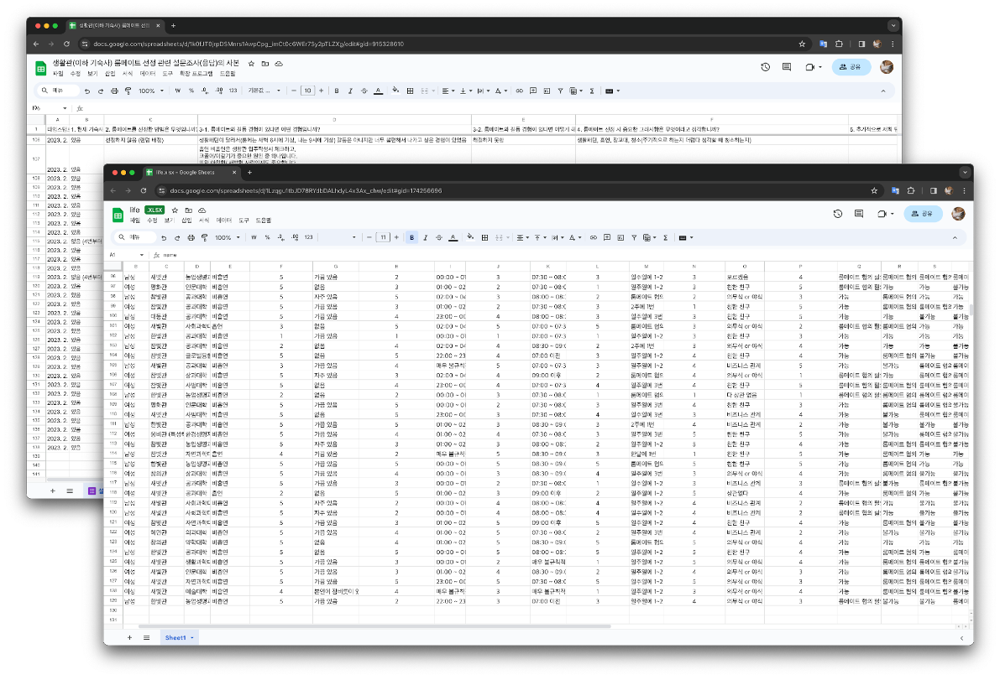
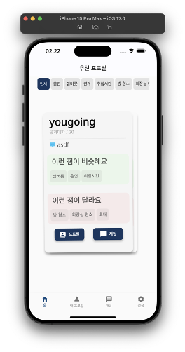
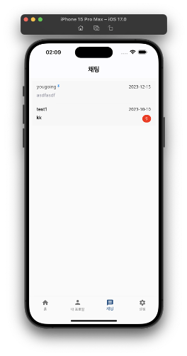

### 개요

'Roomie'는 모바일 기반 룸메이트 매칭 플랫폼입니다.

기존 '[구해줘!룸메](../findRoommate)' 프로젝트를 모바일 환경에 맞추어 처음부터 개발해 **배포**했습니다.

- 배포: [원스토어](https://m.onestore.co.kr/mobilepoc/apps/appsDetail.omp?prodId=0000774374) | [앱스토어](https://apps.apple.com/us/app/roomie/id6477328689)
- 문서: [](Roomie.pdf)
- 코드: [](https://github.com/rkdbq/Roomie-v2) 
- 사용 기술:  |  | 
- 개발 환경:  | 
- 개발 기간: 2023년 1월 - 2024년 2월

### <u>내가 기여한 점</u>

1. 요구사항 분석
    
    - 두 번의 설문조사를 통해 사용자 요구사항을 정량적으로 확인했습니다.
    - 2023년 1월에 진행한 1차 설문조사에서 138명의 응답을 수집했습니다.
    - 2023년 7월에 진행한 2차 설문조사에서 129명의 응답을 수집했습니다.
2. 추천 시스템 개선
    
    - 기존 사용자가 수동 조작해야 하는 필터에서 Content-based Filtering 기반으로 변경함으로써 사용자 편의를 향상했습니다.
    - Content-based Filtering은 다른 사용자의 데이터를 필요로 하지 않으므로 초기 서비스에 적절하다고 생각해 채택했습니다.
    - 사용자의 피드백에 따라 각 항목의 가중치를 조절해 더 나은 프로필이 추천되도록 했습니다.
3. 채팅
    
    - 기존 소켓 통신 방식에서 Flutter의 Stream을 통해 비동기 방식으로 전환함으로써 비동기 통신 또한 가능하도록 했습니다.

### 한계

1. 유지보수
    - 기존 기숙사 시스템 개편으로 인해 충분한 사용자를 확보하지 못했습니다.
2. 세부 기능
    - 다국어 지원 등 세부 기능을 추가해야 할 필요가 있습니다.